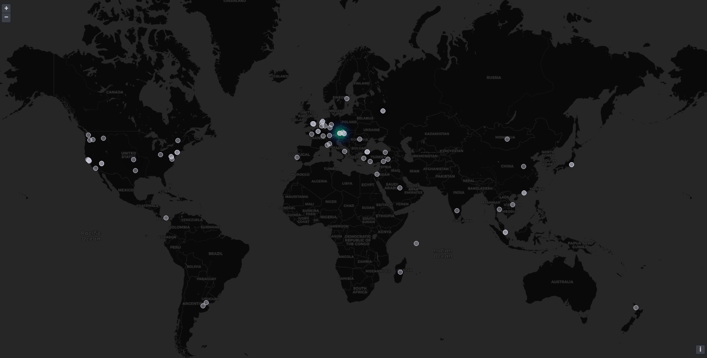

# yomite
読みて - read

An easily extensible python application that usually runs in a docker container, reads logs and writes results into a database. 

Initially written to read nginx `access.log` including location data (ngx_http_geoip2_module) to visualize requests on a worldmap using grafana:

## Caution
This project is mostly intended for prototyping and likely performs poorly on busy servers. 
The current data structure results in a rather high series cardinality in InfluxDb.